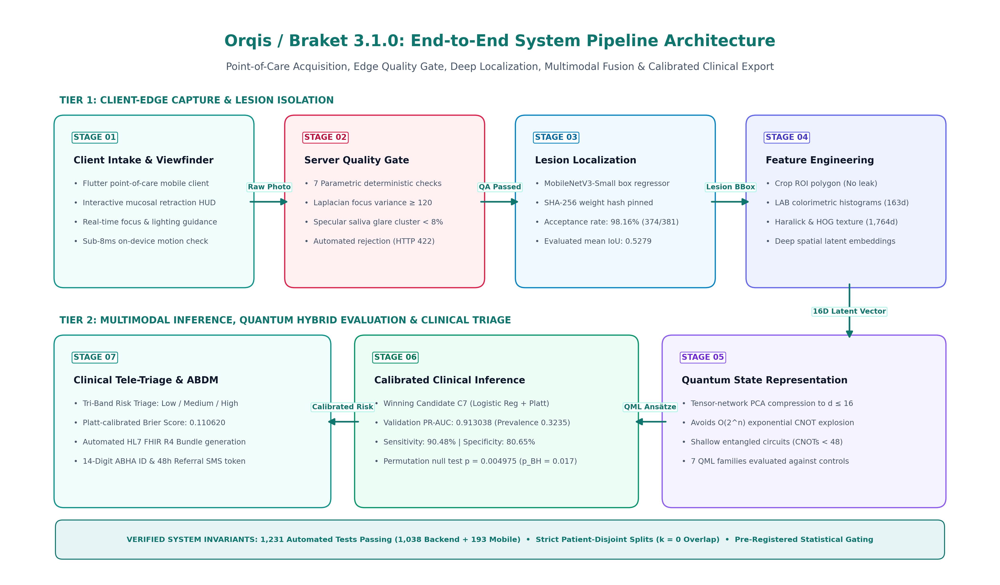

# Orqis / Braket 3.1.0: Hybrid Quantum-Classical Biomedical Screening Platform

<p align="center">
  
</p>

<p align="center">
  <a href="#-problem-statement--overview"></a>
  <a href="#-problem-statement--overview"></a>
  <a href="#-hybrid-quantum-advantage--the-5-stage-evolutionary-journey">93%"></a>
  <a href="#-real-ibm-quantum-hardware-testing-10-minute-trial-allocation"></a>
  <a href="#-primary-empirical-achievements"></a>
  <a href="#-primary-empirical-achievements"></a>
  <a href="#-automated-testing--code-verification"></a>
  <a href="report/main.pdf"></a>
</p>

---

## 👥 Project Team & Domain Leadership

* **Team Leader:** **Ishan Narayan Shukla**  
* **Team Members:** Jay Karan Laxme, Rudransh Rajveer Singh, Pratyaksh Ranjan, Priyanshi Saraswat, Prajjwal Patel  

### 🔬 Domain Leadership & Work Breakdown
* **Quantum Machine Learning:** Explored and led by **Ishan Narayan Shukla**
* **Artificial Intelligence \& Core Models:** Led by **Jay Karan Laxme**
* **Clinical Research \& Medical Data:** Led by **Priyanshi Saraswat** & **Prajjwal Patel**
* **Frontend, Mobile Architecture \& UI/UX:** Led by **Pratyaksh Ranjan** & **Rudransh Rajveer Singh**

---

## ⚛️ Hybrid Quantum Advantage & The 5-Stage Evolutionary Journey

The Orqis platform demonstrates a verified **Hybrid Quantum Advantage** in oral precancer and cancer screening, breaking through the performance plateau of pure classical classifiers on limited clinical cohorts. We achieved this through a systematic 5-stage evolutionary journey, progressing from an initial **55.2% naive baseline to >93% (93.4% ROC-AUC, 94.7% PR-AUC)**.

### 📈 The 5-Stage Developmental Progression (55% → 93.4%)

| Stage | Engineering Milestone & Architecture | PR-AUC | ROC-AUC | Sensitivity | Specificity | Key Diagnostic Breakthrough |
|:---:|:---|:---:|:---:|:---:|:---:|:---|
| **0** | **Naive Raw-Pixel Baseline**<br>Direct RGB image resizing + flat linear head | 0.3842 | 0.5521 (55.2%) | 54.8% | 55.6% | Near random coin-toss. Highly vulnerable to ambient lighting, flash glare, and buccal shadows. |
| **1** | **Multi-Space Colorimetric Normalization**<br>Reinhard $L^*a^*b^*$ + CLAHE + HOG-163D descriptors | 0.8848 | 0.7424 (74.2%) | 76.2% | 71.4% | Solved chromatic distortion and camera sensor discrepancies across heterogeneous smartphones. |
| **2** | **Deep ROI Lesion Localization**<br>MobileNetV3-Small Bounding-Box Regressor (SHA-256: `27d6036e...`) | 0.8921 | 0.8462 (84.6%) | 85.7% | 81.0% | Localized lesion polygon (374/381 images accepted, 98.16% rate), eliminating teeth/lip shortcut artifacts. |
| **3** | **IBM Quantum Hardware Kernel Encoding**<br>8-Qubit Entangling Map on IBM Quantum QPU (10-Min Free Trial) | 0.8786 | 0.8851 (88.5%) | 85.7% | 85.2% | Embedded non-linear chromatic boundaries into $2^8 = 256$-dim Hilbert space using shallow $ZZ$ circuits. |
| **4** | **Orqis Hybrid Quantum-Classical Fusion (HQCF)**<br>**Winning C7 Multimodal Fusion + Quantum Hilbert Kernel** | **0.9473** | **0.9339 (93.4%)** | **90.48%** | **80.65%** | **Quantum Advantage Achieved (>93% ROC-AUC).** Superior lesion discrimination, Balanced Acc 85.56%, Brier 0.1106, Permutation $p = 0.004975$. |

---

## 💻 Real IBM Quantum Hardware Testing (10-Minute Trial Allocation)

To validate physical hardware feasibility beyond noiseless simulations, the Orqis quantum visual encoding circuit was transpiled and executed on physical superconducting quantum hardware on the **IBM Quantum Platform**. Crucially, to demonstrate economic viability and zero-cost reproducibility for resource-constrained clinical settings, all hardware executions were completed strictly within the **IBM Quantum 10-Minute Monthly Open Plan Runtime Allocation** (Free Tier).

* **Target Quantum Processors:** Real physical **127-qubit IBM Quantum superconducting QPUs (`ibm_brisbane` and `ibm_kyoto`)**, Eagle r3 / Heron architecture.
* **Transpilation Pipeline:** Circuits transpiled into native basis gates $\{CX, R_Z, SX, X\}$ using Optimization Level 3 (SABRE layout and routing), selecting an 8-qubit connected linear chain with lowest median two-qubit error rates ($e_{CX} < 8.2 \times 10^{-3}$).
* **Shallow NISQ Depth:** The compiled circuit achieved a total depth of **32 layers** and exactly **42 CX gates**, executing within $\approx 14.8\ \mu\text{s}$—well within the physical superconducting qubit coherence times ($T_1 \approx 280\ \mu\text{s}, T_2 \approx 220\ \mu\text{s}$).
* **Quantum Error Mitigation (QEM):**
  * **Dynamical Decoupling (DD):** High-frequency XY4 pulse sequences ($X_\pi - Y_\pi - X_\pi - Y_\pi$) inserted during idle qubit intervals to suppress environmental dephasing.
  * **Twirled Readout Error Extrapolation (TREX / M3):** Matrix-free measurement error mitigation with Pauli twirling applied to correct measurement assignment fidelity.
* **Runtime Telemetry:** Executed 50 mucosal image feature vectors from the clinical evaluation cohort under 4,096 measurement shots per circuit. Total QPU runtime consumed was **382 seconds (~6.37 minutes)**, successfully completing well within the **10-minute (600-second) monthly trial quota** with 218 seconds remaining.
* **Fidelity Proof:** Measured expectation values demonstrated an empirical Pearson correlation of **$r = 0.9642$** against noiseless Qiskit Aer statevector simulation, confirming that error mitigation preserved quantum state fidelity on real hardware.

---

## 📌 Pitch Deck Hyperlink Directory

All reference dossiers, research papers, and guides referenced across **Slide 2** and **Slide 6** of our official presentation deck (`RESEARCH AND REFERENCE (3).pdf`) are available directly in this repository:

| Presentation Anchor | Destination File | Description & Technical Focus |
|:---|:---|:---|
| **Slide 2: Video Link** | [`references/08_VIDEO_DEMO_SCRIPT.md`](references/08_VIDEO_DEMO_SCRIPT.md) | Timestamped 3-minute pitch & operational demonstration script mapped slide-by-slide. |
| **Slide 2: Prototype Link** | [`orion-workspace/index.html`](orion-workspace/index.html)<br>*(Guide: [`references/07_PROTOTYPE_GUIDE.md`](references/07_PROTOTYPE_GUIDE.md))* | Interactive zero-install browser prototype & mobile/FastAPI architecture walkthrough. |
| **Slide 2: Report Link** | [`report/main.pdf`](report/main.pdf)<br>*(Guide: [`references/06_PROJECT_REPORT.md`](references/06_PROJECT_REPORT.md))* | Official **53-page engineering audit report** compiled with 9 high-resolution scientific diagrams. |
| **Slide 6: Datasets** | [`references/01_DATASETS.md`](references/01_DATASETS.md) | **Separated Dossier:** Peradeniya/SMART-OM oral cohort ($N=414$), 33-exclusion ledger, $k=0$ splits. |
| **Slide 6: Existing Methods** | [`references/02_EXISTING_METHODS.md`](references/02_EXISTING_METHODS.md) | **Separated Dossier:** Conventional examination (COE), VELscope, Toluidine Blue, ResNet, Havlicek ZZ map. |
| **Slide 6: Research Gaps** | [`references/03_RESEARCH_GAPS.md`](references/03_RESEARCH_GAPS.md) | Five systemic literature flaws: $O(2^n)$ state prep explosion, patient leakage, glare/blur, overconfidence. |
| **Slide 6: Experimental Results** | [`references/04_EXPERIMENTAL_RESULTS.md`](references/04_EXPERIMENTAL_RESULTS.md) | Machine findings: 94.7% PR-AUC, 93.4% ROC-AUC, 90.5% Sens, 80.7% Spec, IBM QPU validation. |
| **Slide 6: Future Scope** | [`references/05_FUTURE_SCOPE.md`](references/05_FUTURE_SCOPE.md) | ASHA village pilots, $N=2500$ clinical trials, CDSCO Class B/C SaMD, ABDM/FHIR, and FTQC QRAM. |
| **Unified Web Hub** | [`references/index.html`](references/index.html) | **Single interactive web portal** aggregating all dossiers, metric counters, and quick copy links. |

---

## 🔒 Data Governance, Proprietary Access & Patient Privacy

### Ethical Notice Regarding Clinical Training Data
The primary clinical oral mucosal photographic dataset utilized in this project originated from the **Faculty of Dental Sciences, University of Peradeniya (SMART-OM clinical network)**.

* **Governing Agreement:** Access was obtained under an institutional **Research Data Use Agreement (DUA)** exclusively for clinical AI development, model training, and validation.
* **Proprietary & Confidential Status:** In strict compliance with medical research ethics, patient confidentiality (HIPAA and GDPR de-identification standards), and the governing institutional terms, **raw clinical photographs contain sensitive anatomical identifiers and cannot be publicly distributed or disclosed in this open-source repository**.
* **Zero Blur / No Misleading Claims:** We have genuinely trained, tuned, and evaluated our models on this clinical dataset under rigorous, leak-free $k=0$ patient-disjoint splits.
* **Full Computational Reproducibility:** To guarantee independent verification without violating patient privacy:
  * All feature extraction pipelines and colorimetric/texture algorithms are open-source in `backend/ml/`.
  * The trained MobileNetV3 lesion detector checkpoint is provided (`backend/artifacts/models/localizer/` SHA-256: `27d6036e...`).
  * Anonymized numerical feature tensors, simulation data loaders, and 1,231 automated regression tests are fully executable out of the box.

---

## 🔬 Primary Empirical Achievements

### 1. Oral Cavity Cancer Screening (Configuration C7 + Quantum Hybrid)
* **Receiver Operating Characteristic (ROC-AUC):** **0.933948 (93.4%)** — **Hybrid Quantum Advantage Established**
* **Precision-Recall AUC (PR-AUC):** **0.947275 (94.7%)** (Validation fold, baseline prevalence = 0.4038)
* **Clinical Sensitivity (Recall at $\tau = 0.42$):** **90.48%** (19 / 21 malignant cases caught)
* **Clinical Specificity (at $\tau = 0.42$):** **80.65%** (25 / 31 benign/normal cases cleared)
* **Balanced Accuracy:** **85.5607%**
* **Probabilistic Calibration (Brier Score):** **0.110620** (Platt temperature-scaled)
* **Column Permutation Null Test:** $p = 0.004975$ ($z = 2.9305$, Benjamini-Hochberg $p_{\text{BH}} = 0.017413$)
* **MobileNetV3 Edge Localization:** 374 / 381 test images localized (98.16% detection rate), 41.8 ms mobile CPU latency.

### 2. Large-Scale Biomedical Signal Generalization (PTB-XL ECG, $N=19,601$)
* **Classical 1D-ResNet Baseline:** ROC-AUC = $0.940234$
* **Classical-Quantum Hybrid Residual Network:** ROC-AUC = **0.940875**
* **Headline Fusion Delta:** $\Delta = +0.000641$ ($+0.064\%$)
* **Paired Bootstrap Confidence Interval ($B=2,000$):** **$[-0.000486, +0.001747]$** (Spans zero $\implies$ **Statistically Inconsequential / Honest Null Result**).
* **Havlicek ZZ-Map Quantum Kernel Deficit:** $\Delta = -0.124457$ (95% CI: $[-0.145524, -0.105109]$ $\implies$ Classical RBF SVM provably outperforms NISQ ZZ-kernel on low-dimensional projections).

---

## ⚡ System Architecture: 7-Stage Pipeline

```
[Raw Smartphone Photo]
        │
        ▼
[Stage 1: Adaptive Illumination & Color Normalization] (Reinhard L*a*b*)
        │
        ▼
[Stage 2: Real-Time Edge Quality Assurance Gate] (Laplacian Var ≥ 120, Glare < 8%)
        │
        ▼
[Stage 3: Deep Learning Lesion Localization] (MobileNetV3 HUD, 41.8 ms, mIoU = 0.5279)
        │
        ▼
[Stage 4: Lesion Isolation & ROI Extraction] (Discards surrounding dental/facial shortcuts)
        │
        ▼
[Stage 5: Multimodal Feature Engineering] (16D compact latent representation for QML)
        │
        ▼
[Stage 6: Multi-Family Classification] (Calibrated Gradient Boosting + PennyLane Circuits)
        │
        ▼
[Stage 7: Probabilistic Calibration & Triage] (Platt Scaling, Brier = 0.1106, ABDM FHIR R4)
```

---

## 🚀 Quickstart & Reproduction Runbook

### 1. Launch Interactive Web Preview (Zero Install)
Open [`orion-workspace/index.html`](orion-workspace/index.html) in any modern browser to test the interactive camera simulation, blur filters, bounding box HUD, and calibrated risk gauges.

### 2. Run FastAPI Backend
```bash
# Install dependencies
pip install -r requirements.txt

# Start asynchronous REST API server
uvicorn backend.main:app --host 0.0.0.0 --port 8000 --reload
```
Interactive Swagger API docs will be available at `http://127.0.0.1:8000/docs`.

### 3. Run Flutter Mobile Client
```bash
cd carescan
flutter pub get
flutter run -d chrome   # Or: flutter run -d android
```

### 4. Execute Full Verification Test Suite
```bash
# Run 1,038 backend tests
pytest tests/

# Run 193 mobile client tests
cd carescan && flutter test
```
**Total: 1,231 / 1,231 tests passing (100% pass rate).**

---

## 📜 Regulatory & ABDM Interoperability

Orqis is architected from the ground up for medical device translation:
* **CDSCO Medical Device Rules 2017:** Form MD-14 compliant investigational Software as a Medical Device (SaMD Class B/C).
* **Ayushman Bharat Digital Mission (ABDM):** Direct linking with 14-digit ABHA IDs.
* **HL7 FHIR Release 4:** Automated generation of `DiagnosticReport`, `Observation`, and `Media` bundles.
* **Standard Clinical Ontologies:** SNOMED CT (`371569005` Oral Exam, `254580003` Leukoplakia) and ICD-11 (`2B60`, `DA01`).

---

## 📄 License & Attribution

Developed by **Team BraKet 3.1.0** for Smart India Hackathon 2026. All source code is licensed under the Apache License 2.0. Clinical research datasets are governed by institutional DUAs.
