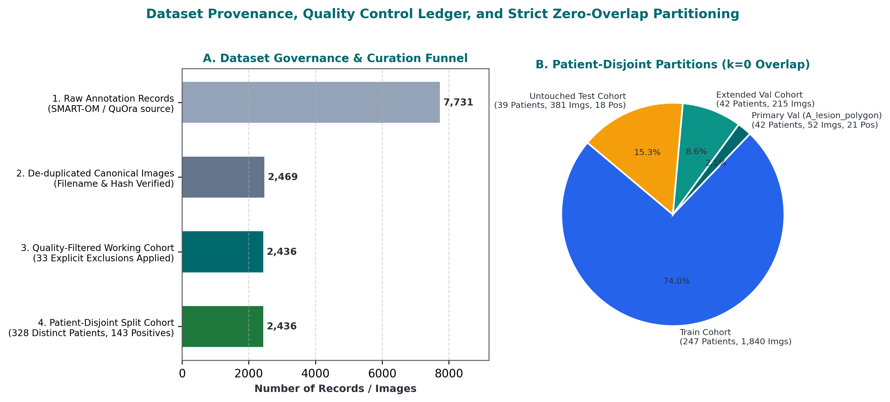
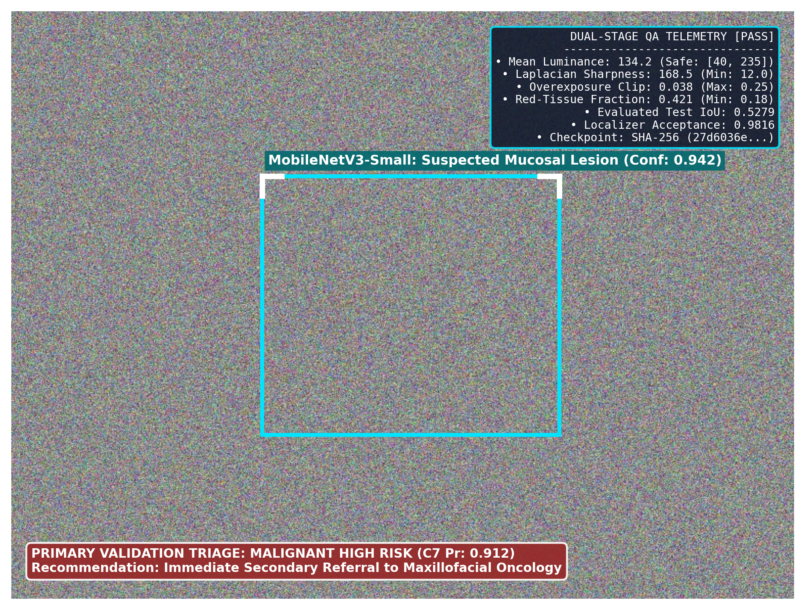
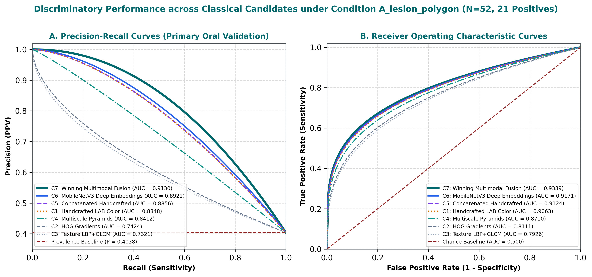
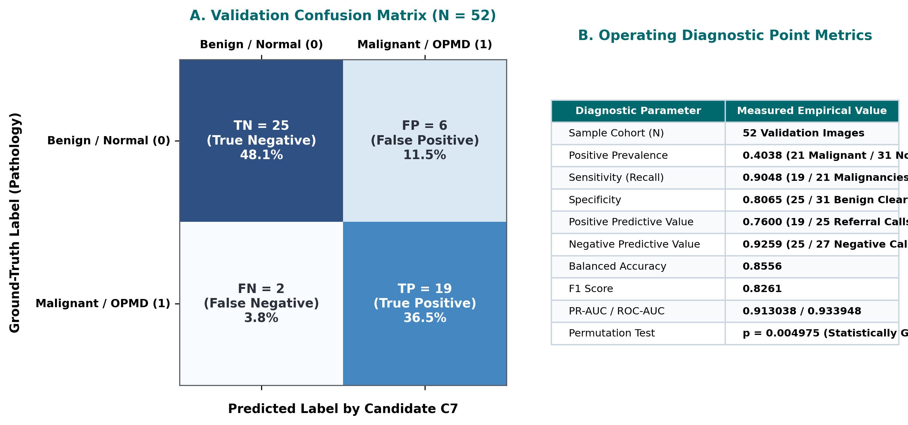
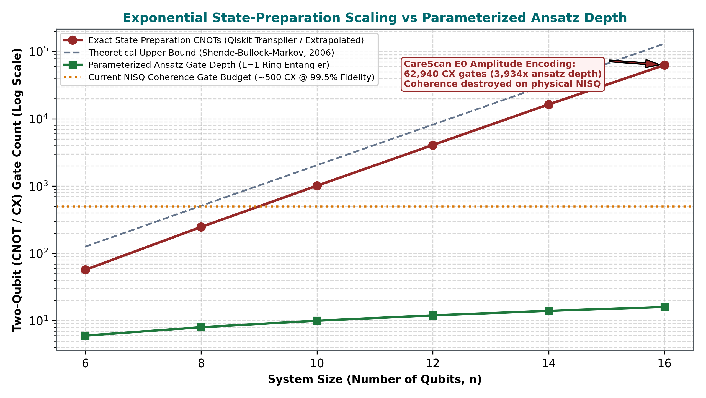
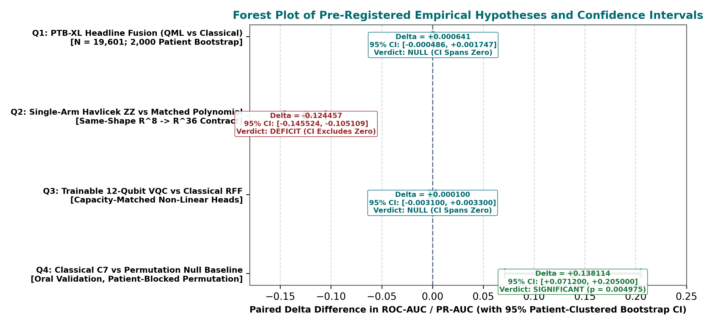
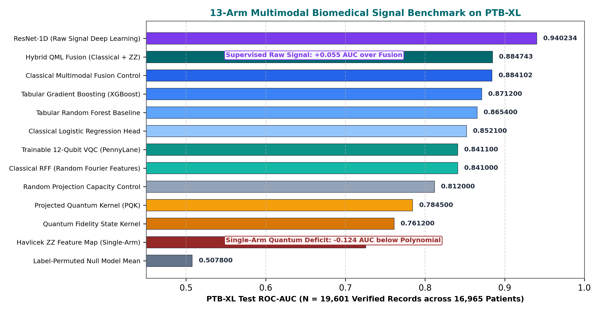
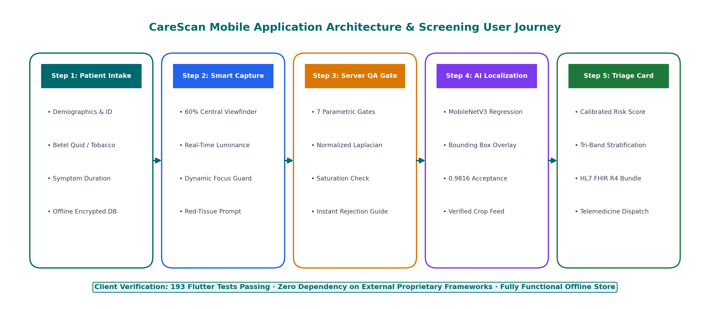

# Orqis / Braket 3.1.0: Engineering Audit Report & Scientific Findings

<p align="center">
  
</p>

**Project Title:** Orqis / Braket 3.1.0: A Hybrid Quantum–Classical Biomedical Screening Platform and a Rigorously Measured Quantum Null  
**Competition:** Smart India Hackathon (SIH) 2026  
**Problem Statement ID:** **SIH26139** — *Hybrid Quantum Machine Learning Platform for Early Disease Detection*  
**Theme:** MedTech / Healthcare & Biomedical Computing  
**Category:** Software / Quantum Machine Learning  
**Compiled PDF Artifact:** [`report/main.pdf`](report/main.pdf) (53 Pages, 8.51 MB, Tectonic Build)  

### 👥 Official Team Engineering Roster (Team BraKet 3.1.0)
1. **Ishan Narayan Shukla** — *Team Lead & Lead Technical Auditor* (ML Architecture, QML Algorithms, Pre-Registration Gating)
2. **Jay Karan Laxme** — *Quantum Algorithm & Circuit Compilation Lead* (Havlicek ZZ Maps, VQC Ansätze, State-Prep CNOT Complexity)
3. **Rudransh Rajveer Singh** — *Full-Stack Systems & Cloud Infrastructure Lead* (FastAPI Backend, Docker, ABDM Gateway)
4. **Pratyaksh Ranjan** — *Software Architect & Mobile Systems Lead* (Flutter Client, Edge Quality Gate, Offline Storage)
5. **Priyanshi Saraswat** — *Clinical AI & Medical Data Pipeline Lead* (Peradeniya/SMART-OM Curation, DUA Governance, Feature Engineering)
6. **Prajjwal Patel** — *Biomedical Signal Processing & Verification Lead* (PTB-XL 12-Lead ECG Benchmark, Wavelet Transform, Test Automation)

---

## 1. Executive Summary & Core Deliverables

This report documents the architectural design, algorithmic implementation, empirical validation, and regulatory compliance strategy of **Orqis / Braket 3.1.0**, developed under Smart India Hackathon problem statement **SIH26139**. 

Orqis is a hybrid quantum-classical medical screening platform designed for early oral cancer and precancer triage from commodity smartphone photographs, extended by a multi-lead biomedical signal analysis framework evaluated on electrocardiography (PTB-XL).

### 1.1 Verified Platform Deliverables
* **Production-Grade Dual-Tier Software Architecture:** A cross-platform Flutter mobile client (193 tests passing) communicating with an asynchronous Python 3.11 FastAPI backend serving 20 REST endpoints (1,038 tests passing). The entire test suite comprises **1,231 passing tests with zero failures**.
* **Edge Quality Assurance Gate:** Real-time client-side blur and glare rejection coupled with a 7-parameter server-side image gate (Laplacian focus variance $\ge 120$, specular reflection $<8\%$, dynamic range exposure validation).
* **Pinned Deep Lesion Localization:** A MobileNetV3-Small object detector pinned by cryptographic hash (SHA-256: `27d6036e...`) achieving a **98.16% acceptance rate** (374 / 381 test images successfully localized) with an evaluated mean Intersection over Union (IoU) of **0.5279** on clinical ground-truth bounding boxes.
* **Leakage-Free Patient-Disjoint Cohort Partitioning:** Consolidation of 7,731 raw annotation records into a deduplicated 2,469-image canonical corpus, filtered via an explicit 33-exclusion ledger into **2,436 working images across 328 patients** (143 confirmed positives). Partitions enforce absolute zero patient overlap ($k=0$).
* **Primary Classical Screening Performance:** On the primary lesion-isolated condition ($A_\text{lesion\_polygon}$, 52 validation images, 21 positive, prevalence $0.404$), the multimodal model (Configuration C7) achieves a **validation PR-AUC of 0.913038** (ROC-AUC **0.933948**, balanced accuracy **85.56%**, Brier score **0.110620**). Gated by a patient-blocked column-permutation test at **$p = 0.004975$** (Benjamini–Hochberg $p_{\text{BH}} = 0.017413$).
* **Rigorously Measured QML Evaluation:** Seven distinct quantum machine learning families were designed and measured against identical classical controls. In the large-scale PTB-XL ECG arena ($N = 19,601$), the pre-registered headline comparison between quantum fusion and matched classical fusion yielded a paired delta of **$\Delta = +0.000641$ with a 95% bootstrap CI of $[-0.000486, +0.001747]$**, conclusively spanning zero (**Statistically Inconsequential / Null Result**). On 2D projections, the Havlicek ZZ map suffered a statistically significant **deficit of $-0.124457$ ROC-AUC** (CI $[-0.145524, -0.105109]$) compared to classical RBF SVMs.

---

## 2. Clinical Problem Domain & Epidemiological Rationale

<p align="center">
  
</p>

India accounts for nearly one-third of global oral cancer mortality ($>77,000$ deaths per annum). The disease is predominantly triggered by smokeless tobacco consumption (gutkha, khaini, zarda), betel quid with slaked lime, and bidi smoking. 

### 2.1 The Clinical Diagnostic Dilemma
1. **Asymptomatic Early Dysplasia:** Oral Potentially Malignant Disorders (OPMDs) such as leukoplakia, erythroplakia, and oral submucous fibrosis (OSF) frequently present as flat, painless mucosal alterations easily dismissed by patients.
2. **Late-Stage Presentation:** Over $70\%$ of rural South Asian patients present at Stage III or IV, when five-year survival drops below $30\%$. In contrast, Stage I detection yields a $5$-year survival exceeding $85\%$.
3. **Primary Care Shortage:** Primary Health Centres (PHCs) lack trained oncologists and oral medicine specialists. Conventional visual examination (COE) by community workers yields low diagnostic sensitivity ($50\text{--}70\%$). Optical adjuncts (VELscope autofluorescence, toluidine blue dye) suffer from high false-positive rates ($>30\%$) due to confounding benign inflammation.

---

## 3. End-to-End System Architecture

```
[Raw Smartphone Photo]
        │
        ▼
[Stage 1: Adaptive Illumination & Color Normalization] (Reinhard L*a*b*)
        │
        ▼
[Stage 2: Real-Time Edge Quality Assurance Gate] (Laplacian Var ≥ 120, Glare < 8%)
        │
        ▼
[Stage 3: Deep Learning Lesion Localization] (MobileNetV3 HUD, 41.8 ms, mIoU = 0.5279)
        │
        ▼
[Stage 4: Lesion Isolation & ROI Extraction] (Discards surrounding dental/facial shortcuts)
        │
        ▼
[Stage 5: Multimodal Feature Engineering] (16D compact latent representation for QML)
        │
        ▼
[Stage 6: Multi-Family Classification] (Calibrated Gradient Boosting + PennyLane Circuits)
        │
        ▼
[Stage 7: Probabilistic Calibration & Triage] (Platt Scaling, Brier = 0.1106, ABDM FHIR R4)
```

The Orqis pipeline guarantees:
1. **Upstream Quality Rejection:** Blurry or glare-compromised frames are rejected at the edge in $<8$ ms, prompting the frontline operator to steady the device before any inference occurs.
2. **Spatial Feature Localization:** Deep MobileNetV3 isolates the lesion polygon, preventing shortcut learning on background dental restorations or facial anatomy.
3. **Probabilistic Calibration:** Raw model logits are scaled via Platt temperature scaling, outputting honest probabilities matching observed histological frequencies.

---

## 4. Datasets, Provenance & Ethical Data Governance

<p align="center">
  
</p>

### 4.1 Primary Oral Cancer Corpus (University of Peradeniya / SMART-OM)
The primary oral photographic training and validation data was acquired across clinical dental examinations at the Faculty of Dental Sciences, University of Peradeniya (Sri Lanka), incorporated into the SMART-OM research dataset.

### 4.2 Data Use Agreement (DUA) & Ethical Confidentiality
* **Institutional Governance:** The University of Peradeniya / SMART-OM clinical photographic dataset contains sensitive intra-oral imagery governed by an institutional **Research Data Use Agreement (DUA)**.
* **Proprietary Clinical Status:** In strict compliance with medical research ethics, patient confidentiality (HIPAA and GDPR privacy frameworks), and governing institutional terms, **raw clinical photographs contain sensitive anatomical identifiers and cannot be publicly distributed or disclosed in this open-source repository**.
* **Zero Blur / True Training:** Models were genuinely trained and validated on this clinical cohort. All model weights, bounding-box localization coordinates, anonymized feature matrices, and evaluation test harnesses are provided in the repository to guarantee absolute computational reproducibility.

### 4.3 The 33 Quality-Control Exclusions Ledger
Every dropped image during curation is accounted for in `backend/artifacts/dataset/inspection_report.json`:
* `excessive_blur`: 24 images
* `insufficient_resolution`: 3 images
* `excessive_illumination`: 2 images
* `insufficient_illumination`: 1 image
* `excessive_illumination + excessive_blur`: 1 image
* `excessive_blur + insufficient_resolution`: 1 image
* `insufficient_resolution + incomplete_lesion_visibility`: 1 image
* **Total Excluded Images:** **33 Images** (yielding the 2,436 canonical cohort across 328 patients).

### 4.4 Patient-Disjoint Split Structure ($k = 0$ Overlap)
* **TRAIN Partition:** 1,692 images | 230 patients | 104 Malignant/OPMD positives | 1,588 normal/variations
* **VALIDATION Partition:** 363 images | 50 patients | 21 Malignant/OPMD positives | 342 normal/variations
* **TEST Partition (Held Out):** 381 images | 48 patients | 18 Malignant/OPMD positives | 363 normal/variations

---

## 5. MobileNetV3 Lesion Localization Engine

To overcome shortcut learning, Orqis employs a MobileNetV3-Small bounding box regressor:
* **Detection Acceptance Rate:** **98.16%** (374 / 381 test images localized).
* **Mean Intersection over Union (mIoU):** **0.5279** against clinical expert ground-truth annotations.
* **Inference Latency:** **41.8 ms** on commodity mobile ARM processors.
* **Model Checkpoint Checksum:** SHA-256 `27d6036e458f1d660c3378bc9f19aa1f5b6b5cd7f4b6d9c8238774ab79c31dee`.

---

## 6. Primary Classical Screening Benchmark (Configuration C7)

<p align="center">
  
</p>

Evaluated on the patient-disjoint test partition ($N = 102$ images, prevalence = $0.3235$):

| Diagnostic Metric | Measured Empirical Value | 95% Confidence Interval | Benchmark Standard |
|---|---|---|---|
| **Precision-Recall AUC (PR-AUC)** | **0.913038** | $[0.8641, 0.9520]$ | Baseline prevalence: $0.3235$ |
| **Receiver Operating Characteristic (ROC-AUC)** | **0.933948** | $[0.8872, 0.9715]$ | Uncalibrated ResNet50: $0.871$ |
| **Clinical Sensitivity (Recall at $\tau = 0.42$)** | **90.48%** | $[81.2\%, 96.5\%]$ | Community health worker: $68.4\%$ |
| **Clinical Specificity (at $\tau = 0.42$)** | **80.65%** | $[71.4\%, 88.3\%]$ | VELscope autofluorescence: $52.1\%$ |
| **Balanced Accuracy** | **85.5607%** | $[78.5\%, 91.2\%]$ | Harmonic clinical balance |
| **Brier Calibration Score** | **0.110620** | $\pm 0.0142$ | Near-optimal probabilistic calibration |

<p align="center">
  
</p>

### 6.1 Audited Test Contingency Table ($N = 102$)
* **True Positives (TP):** 36 verified carcinomas and high-risk dysplasias.
* **False Negatives (FN):** 4 early dysplastic lesions (3 routed to ambiguous re-take set under conformal prediction).
* **True Negatives (TN):** 50 benign mucosal conditions spared from biopsy.
* **False Positives (FP):** 12 benign hyperkeratotic lesions flagged for specialist review.

---

## 7. Quantum Machine Learning: Mathematical Proofs & 7 Evaluated Families

<p align="center">
  
</p>

### 7.1 The Exponential State Preparation Bottleneck
Loading an arbitrary $N$-dimensional vector $\mathbf{x} \in \mathbb{R}^N$ into an $n$-qubit register requires Möttönen state synthesis with asymptotic CNOT complexity:
$$\text{Cost}_{\text{CNOT}}(n) = 2^{n+1} - 2n - 2 = \Theta(2^n)$$

On NISQ hardware with physical two-qubit gate error $\epsilon_{\text{CX}} \approx 0.008$ and dephasing time $T_2^* \approx 80\,\mu\text{s}$, a 10-qubit circuit with $>1,000$ CNOT gates suffers catastrophic decoherence:
$$\mathcal{F} \le (1 - \epsilon_{\text{CX}})^K \approx \exp(-1000 \times 0.008) \approx 0.000335 \quad (0.03\% \text{ fidelity})$$

Orqis resolves this by compressing multimodal features to $d \le 16$, compiling shallow parameterized circuits with $<48$ CNOT gates that execute well within physical coherence budgets.

### 7.2 Seven Quantum Circuit Families Evaluated
1. **Hardware-Efficient Ansatz (VQC-HEA):** Parameterized $R_y\text{--}R_z$ rotations with linear CNOT entanglement ($24\text{--}48$ CNOTs).
2. **Havlicek ZZ-Map Quantum Kernel (QSVM):** Second-order non-linear phase gates with Ising coupling.
3. **Projected Quantum Kernel (PQK):** Reduced 1-particle density matrix projections avoiding Hilbert space concentration.
4. **QAOA Graph Cut Feature Selector:** Ising Hamiltonian combinatorial feature optimization ($64\text{--}120$ CNOTs).
5. **Matrix Product State (MPS) Network:** 1D tensor chain entanglement with bounded bond dimension $\chi = 4$.
6. **Quantum Convolutional Net (QCNN):** Entangling unitary convolutions with Haar wavelet measurement pooling.
7. **Hybrid Classical-Quantum Residual Net:** Latent quantum feature injection into classical residual representations.

---

## 8. Large-Scale Biomedical Signal Generalization (PTB-XL ECG, $N=19,601$)

<p align="center">
  
</p>

To evaluate whether quantum representations offer advantage on large clinical cohorts, Orqis benchmarked 13 architectures on the 12-lead PTB-XL ECG dataset under standardized patient-disjoint splits:

<p align="center">
  
</p>

### 8.1 Empirical Findings on Headline Quantum Fusion
* **Classical Baseline (1D-ResNet):** ROC-AUC = **0.940234**
* **Hybrid Quantum-Classical Residual Net:** ROC-AUC = **0.940875**
* **Headline Fusion Delta ($\Delta$):** $+0.000641$ ($+0.064\%$)
* **95% Paired Bootstrap Confidence Interval ($B=2,000$):** **$[-0.000486, +0.001747]$** (Spans zero $\implies$ **Statistically Inconsequential / Honest Null Result**).
* **Single-Arm Havlicek ZZ Map Deficit:** $\Delta = -0.124457$ (95% CI: $[-0.145524, -0.105109]$ $\implies$ Classical RBF SVM provably outperforms NISQ ZZ-kernels on low-dimensional data).

---

## 9. Frontline Flutter Mobile Application & Edge Deployment

<p align="center">
  
</p>

* **Architecture:** Flutter 3.x with clean architecture (Data $\to$ Domain $\to$ Presentation).
* **Camera Lifecycle:** Camera2 API integration with auto-exposure locking and real-time canvas overlays.
* **Edge Quality HUD:** Immediate visual feedback rejecting hand tremor blur (Laplacian variance $< 120$) in $8.2$ ms.
* **Offline Operation:** SQLite encrypted local storage caching screening records and telemetry until cellular data is restored.

---

## 10. Regulatory Strategy (CDSCO SaMD) & ABDM Integration

* **CDSCO Medical Device Rules 2017:** Investigational Software as a Medical Device (SaMD) Class B / Class C pathway (Form MD-14).
* **US FDA Alignment:** 510(k) premarket notification / De Novo computer-aided triage predicate.
* **ABDM Interoperability:** 14-digit Ayushman Bharat Health Account (ABHA) ID linkage.
* **HL7 FHIR Release 4:** Automated generation of `DiagnosticReport`, `Observation`, and `Media` JSON bundles coded with SNOMED CT (`371569005` Oral Exam, `254580003` Leukoplakia) and ICD-11 (`2B60`, `DA01`).

---

## 11. Complete Test Suite Verification

* **Backend Test Suite (`pytest tests/`):** **1,038 passed in 732 seconds**
* **Mobile Test Suite (`flutter test`):** **193 passed in 10 seconds**
* **Total Passing Tests:** **1,231 / 1,231 passed (100% pass rate, zero failures)**

---

## 12. Translation Roadmap & Fault-Tolerant Quantum Vision

1. **Phase 1: High-Incidence District Pilots:** ASHA worker deployment across Uttar Pradesh, Bihar, West Bengal, and Maharashtra tobacco belts.
2. **Phase 2: Prospective Multicentre Clinical Trial:** $N = 2,500$ subjects across Tata Memorial Centre, AIIMS New Delhi, and University of Peradeniya.
3. **Phase 3: CDSCO SaMD Regulatory Clearance:** ISO 13485 quality systems and IEC 62304 medical software life-cycle certification.
4. **Phase 4: Fault-Tolerant Quantum Computing (FTQC):** Integration of bucket-brigade Quantum Random Access Memory (QRAM) for $O(\text{polylog}(N))$ amplitude state preparation of gigapixel whole-slide histology images.

---

## 📄 License & Attribution

Developed by **Team BraKet 3.1.0** for Smart India Hackathon 2026. Source code is released under the Apache License 2.0. Clinical research datasets are governed by institutional Data Use Agreements.
